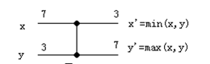
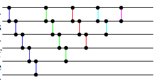
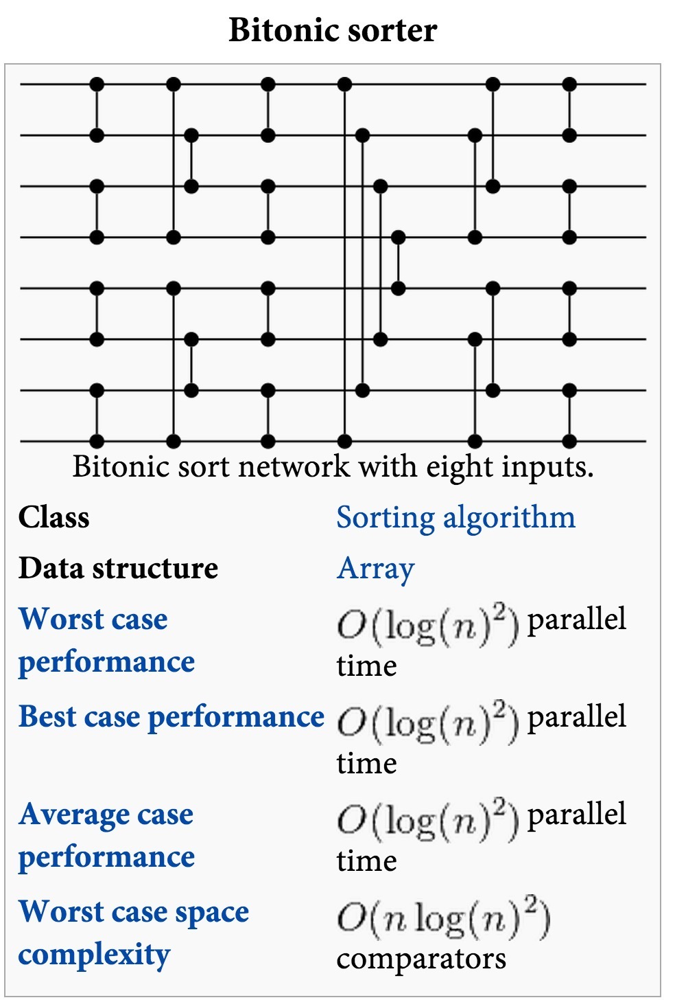
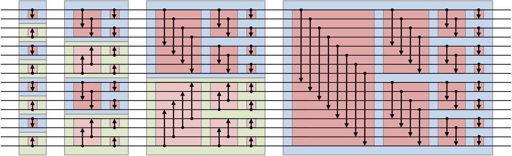
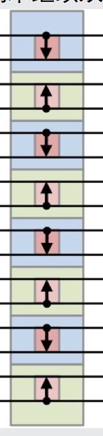
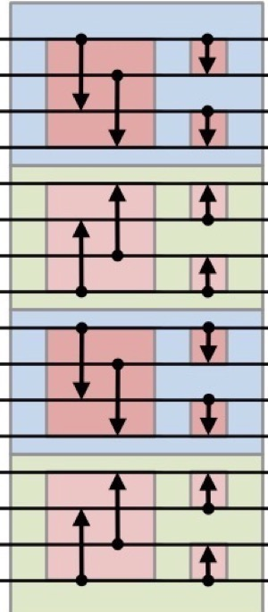
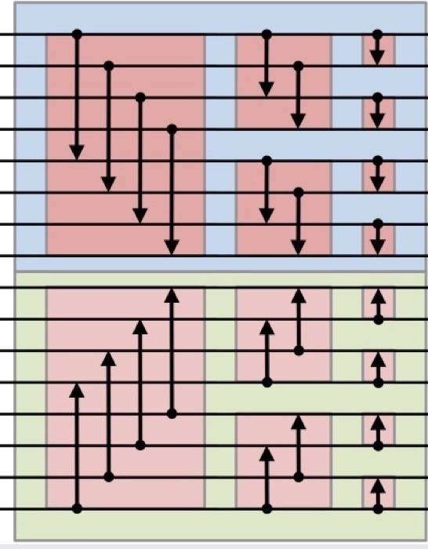
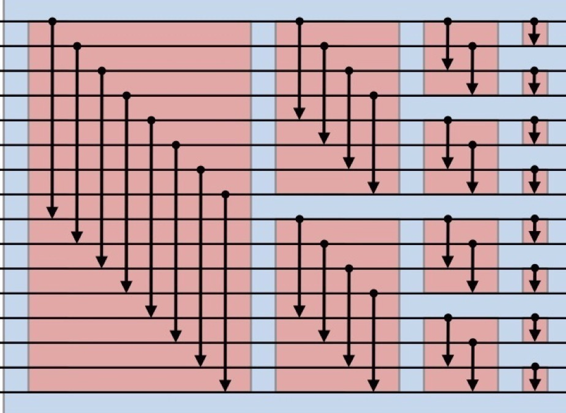
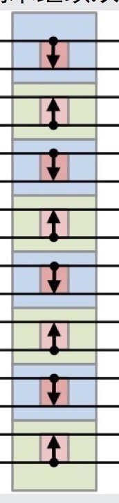

#新生群小课堂 知识总结（四）（未完成）
##并行计算
并行计算对于正常人类来说就是多个处理器计算。

但学长们的并行计算这节课研究的是有无限个处理器的时候，处理速度最快多少。

简单来说，一个核心向另一个核心发送消息需要一个单位时间，而有无限个处理器后，整个程序的运行时间基本就是这些通讯时间。这样，无限个处理器下，解决某个问题需要的最小时间就揭示了解决这个问题时需要的最小相互通信量。不考虑路劲，点到点的距离都是1。

就是说，这个最短时间蕴含了这个问题的一些内在本质。进一步的，整个世界是无限核心并行的，然而我们依旧只能看到10光年外，10年的事情，我们不知道10光年外现在发生了什么，因为光传播需要时间，这和无限核心并行需要通讯时间是一样的。

##排序网络
排序网络是总能对其输入进行排序的比较网络。

一个比较网络由比较器和线路构成。
###比较器

如图，输入x,y，比较后输出，例如输入7,3，输出3,7，输入2,6，输出2,6。
###冒泡排序

上面这两张图是类似的。

先把第1,2个比较，再把第2,3个比较，再把3,4个比较，再把4,5个比较，再把5,6个比较，这样第6个就是最大的；然后再比较出第5个、第4个……最大的数，最后得到一个升序的输出。

但是第一张图不能并行，先后顺序有要求；第二张则可以。大家可以自己找一组数字手动模拟一下。

这张图中，一共n(n-1)/2个比较器，2n-3个步骤，最多的步骤floor(n+1/2)个比较器。

floor是地板函数，表示最大的不超过它的整数。

所以时空复杂度都是n。
###双调排序

//窝大致理解双调是怎么回事……不过下面的解释有些地方感觉有点模糊

时间复杂度是log(n)^2  log指ln；空间复杂度是nlog(n)^2；用空间换时间。//需要解释一下时间复杂度的概念吗

双调是一种并行排序算法，因为决策树有n!那么大，而每次只能削减掉一般。

ln n!~n ln n

就是说，n个数的排列，一共有n!种；

对于i和j，n! 个排列中其中一半是第i个大，一半是第j个大；//这一句的意思是不是可以换个表述

我们每次比较两个数，只能排除掉一半；

所以要达到最后的结果，要比较log_2 n! 次；

log_2 n!～C(n ln n ~ n)用微积分可以估计。

这个东西，看似很大，实际上很有规律。

每一段都包含前一段，类似的，并不完全一样，蓝的和绿的相反，是不同的比较器。

这一步很好理解

关键是

它的用处
##文件系统
可以自己搜索以下名词：
- 文件系统
- NTFS
- ext3、ext4
- ……

##Vim & Emacs -续I
这是两个古老又经典的编辑器，都是Unix时代的上古神器，那时候还没有Winodws，也没有Crtl+C/X/V这样的约定。因为没有标准，所以大家可以各自制定自己的按键方案。例如Crtl在Caps Lock的位置上，所以Emacs大量使用Crtl。那时候也没有鼠标，没有上下左右键，因此上下左右是hjkl。

Emacs是一个通用的编辑器，对不同的文本类型，会启用不同的模式，使得编辑不同类型的文件时响应的按键可以有相似但又适应文件内容的功能。Emacs的状态是比较稳定的。

而Vim则设计成频繁切换的模式，例如普通模式，插入模式等。默认是普通模式，例如hjkl移动，d删除等；按i可以进入编辑模式，这是hjkl等按键就用作输入。进入其他模式后，按esc可以回到普通模式。

为什么选择这些编辑器呢？

因为除去功能的强大，它们的键绑定也使得使用者的手指不用离开主键区，对于有肌肉记忆以后大量输入文本是很重要的效率提升。此外在其他IDE中也可以使用它们的键绑定。简单来说就是键盘比鼠标快，而且不用移出主键区，手指可以一直快速响应。

###题外-一段历史
Emacs是Richard Stallman做的，他毕业于哈佛，在MIT工作，研究AI；Lisp则是MIT的John McCarthy为了搞AI而实现的，但后来Bell Lab的C/UNIX风行，他们就做了用Lisp的Emacs，把它做得很强大，这样所有操作都可以用Emacs完成，就不需要C了，所以又说Emacs是一个操作系统。
> C面向汇编和内存，而Lisp更加抽象和数学化。

但最终他们还是用C搞了GNU项目，叫GnU/Hurd，但是内核没做出来；90年代时，Linus做了Linux，所以至今GNU内核是Linux。此外他们还做了GNU/GPL，这是一个协议，General Public License，GPL要求用了GPL的代码就要开源。比如Cisco的路由器用了GPL代码却没有开源，后来迫于压力还是开源了，这样才有了今天的openWRT等自由的路由器系统。

GPL保护程序自由，有病毒一样的传染能力，这也是一种自我防卫：如果闭源项目没有协议地使用GNU开源项目的代码，开源项目却无法从闭源项目那里成长，就十分不平衡了。此外联邦法院在某场官司中判定GPL胜诉，使它具有了法律效力。开源开放源代码，以之鼓励社区合作；自由软件则是要求基于自由的人自己也要保障他人的自由。当然一味自由也可能导致滥用，需要约束。

Unix是汤姆森和里奇度假时用一个月写出来的，当时大概1万行代码，因此它的哲学是精简，如无必要，不使用更复杂的算法。Unix现在已经死了，很多现在的事物当时还没有出现。比如Unix中一切都是文件与字符串，但网络大规模普及后，这个模型就不适用了。

##Ingress
一个虚拟现实游戏，很有趣，须翻墙。
##Processing
Processing是一种开源编程语言，专门为电子艺术和视觉交互设计而创建，其目的是通过可视化的方式辅助编程教学，并在此基础之上表达数字创意。……直接一点就是可以用它做图。
##Git
//窝传了一份自己以前的笔记，参考一下，Git.html……噗十分不优雅然而窝比较懒直接导出了wiznote
沙县

开沙县 git init

菜谱 repo  clone

比较菜谱不同 git diff

菜谱可以修改，可以新创一道菜，但是要保存你的菜谱，要git commit，这样就永远不会丢失了
git log 查看commit的记录和代号

